# CppRobotics
  

Cpp implementation of robotics algorithms including localization, path planning, path tracking and control, inspired by [PythonRobotics](https://github.com/AtsushiSakai/PythonRobotics) and [MotionPlanning](https://github.com/zhm-real/MotionPlanning).

## 📌Requirement

- CMake
- Eigen3
- [fmt](https://github.com/fmtlib/fmt)
- CppAD & IPOPT ( *for MPC convex optimization* )

Because this project uses  [matplotlib-cpp](https://github.com/lava/matplotlib-cpp)  for visualization, you also need to ensure that you have Python3.x, and contain the following packages:

- matplotlib
- numpy

You can find [install-tips](./assets/install-tips.md) for some third-party libraries here.

## 🛠Build

```shell
git clone git@github.com:PuYuuu/CppRobotics.git
cd CppRobotics
mkdir build && cd build
cmake ..
make -j6
```

Find all the executable files in **$workspace/bin**. By the way, all code development and debugging of this project are completed under WSL2. Currently, WSL2 natively supports GUI on Win10/Win11 without any configuration. For details, refer to [gui-apps](https://learn.microsoft.com/en-us/windows/wsl/tutorials/gui-apps) .

## 🎈Animations

### Perception

<div align=center>
<table>
  <tr>
    <td>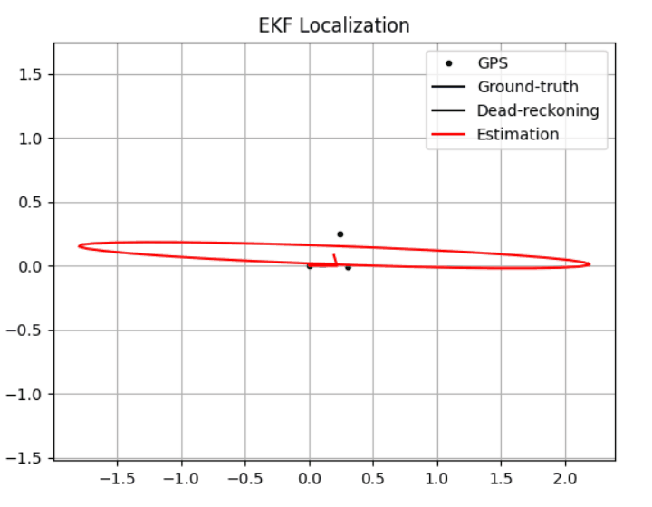</a></td>
    <td>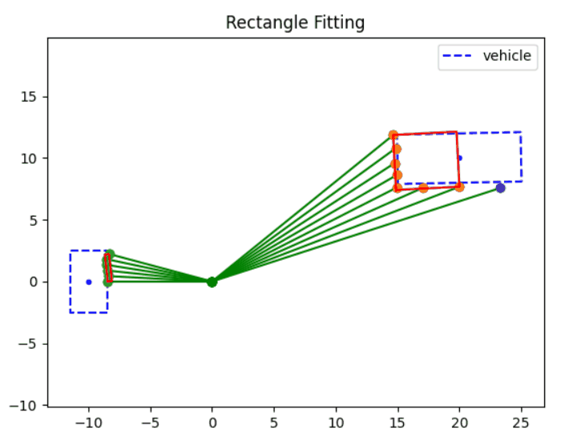</a></td>
  </tr>
</table>
</div>

### PathPlanning

#### GlobalPlanner

##### Search_based Planning

<div align=center>
<table>
  <tr>
    <td>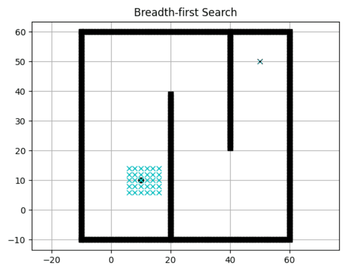</a></td>
    <td>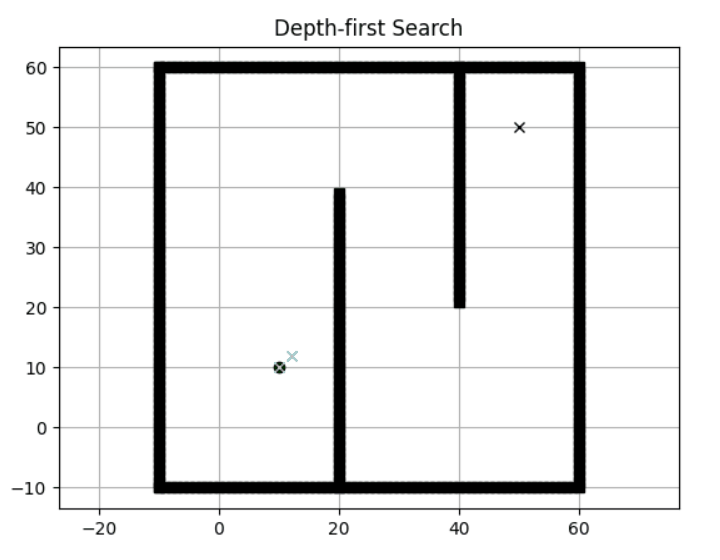</a></td>
  </tr>
</table>
</div>
<div align=center>
<table>
  <tr>
    <td>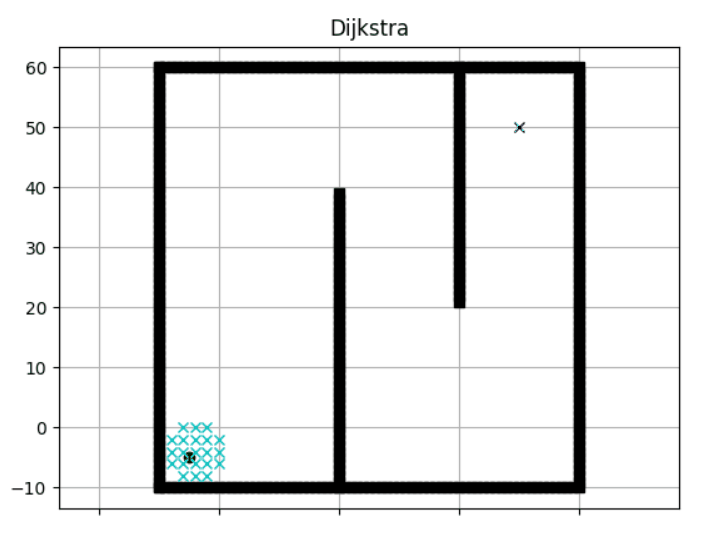</a></td>
    <td></a></td>
  </tr>
</table>
</div>
<div align=center>
<table>
  <tr>
    <td>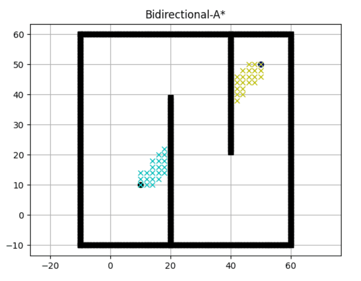</a></td>
    <td>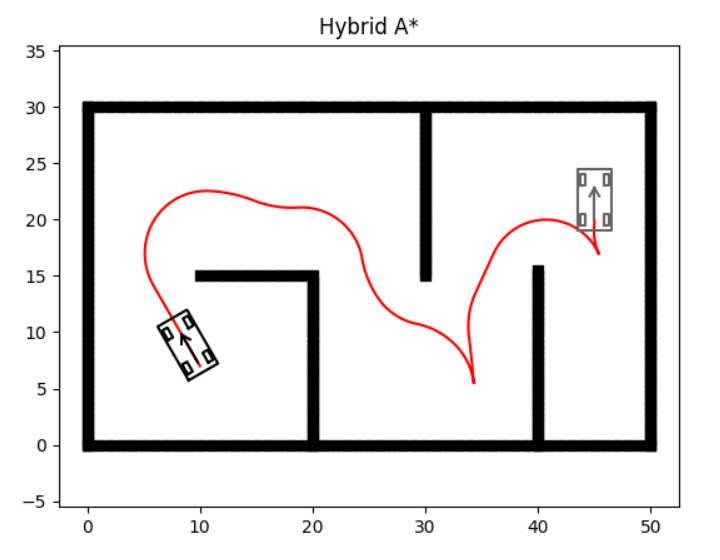</a></td>
  </tr>
</table>
</div>
<div align=center>
<table>
  <tr>
    <td>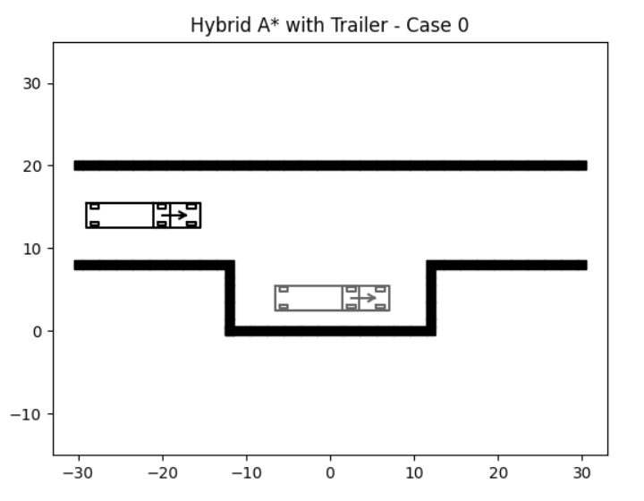</a></td>
    <td>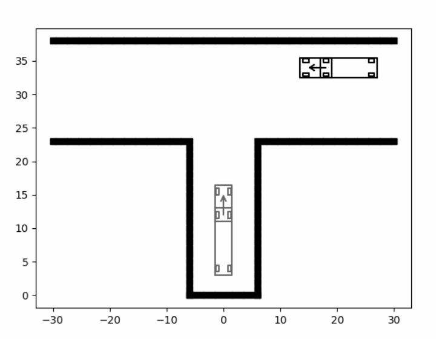</a></td>
  </tr>
</table>
</div>

##### Sampling_based Planning

<div align=center>
<table>
  <tr>
    <td>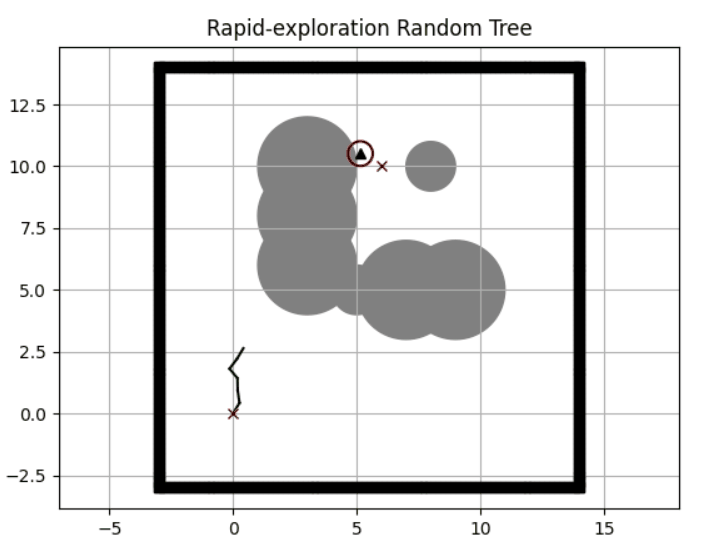</a></td>
    <td>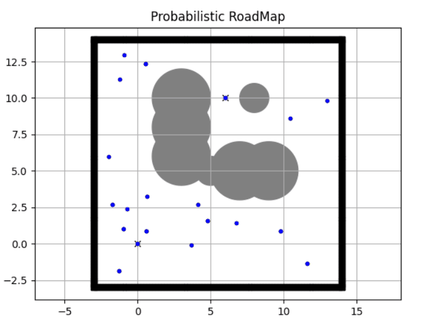</a></td>
  </tr>
</table>
</div>

#### LocalPlanner

<div align=center>
<table>
  <tr>
    <td></a></td>
    <td>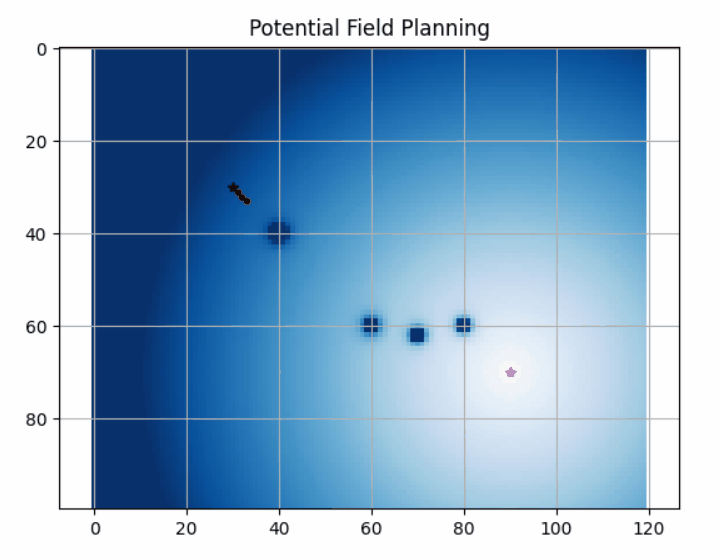</a></td>
  </tr>
</table>
</div>

<div align=center>
<table>
  <tr>
    <td>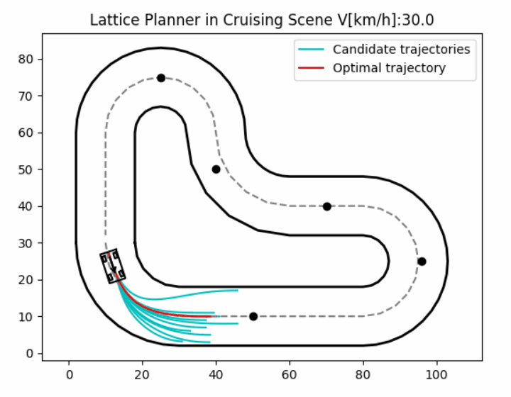</a></td>
    <td>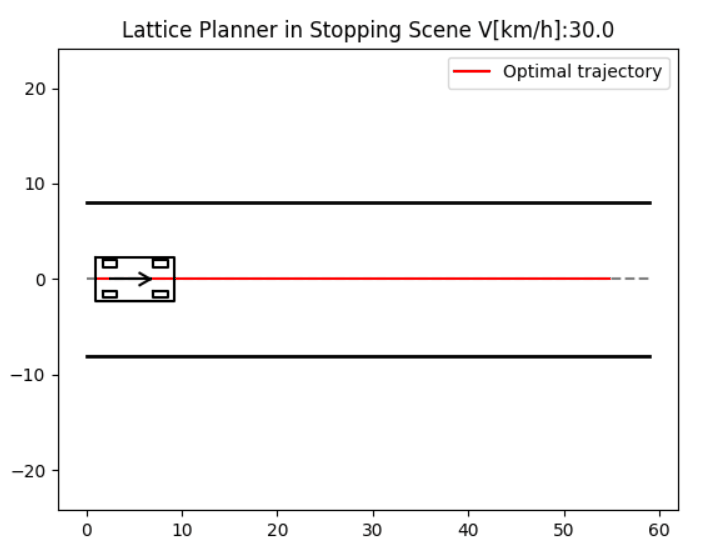</a></td>
  </tr>
</table>
</div>

#### CurvesGenerator

<div align=center>
<table>
  <tr>
    <td>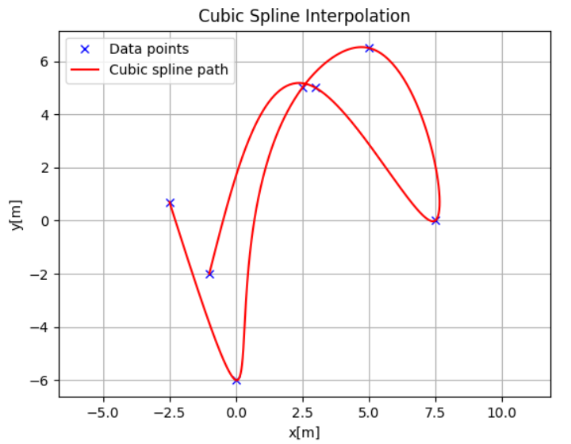</a></td>
    <td>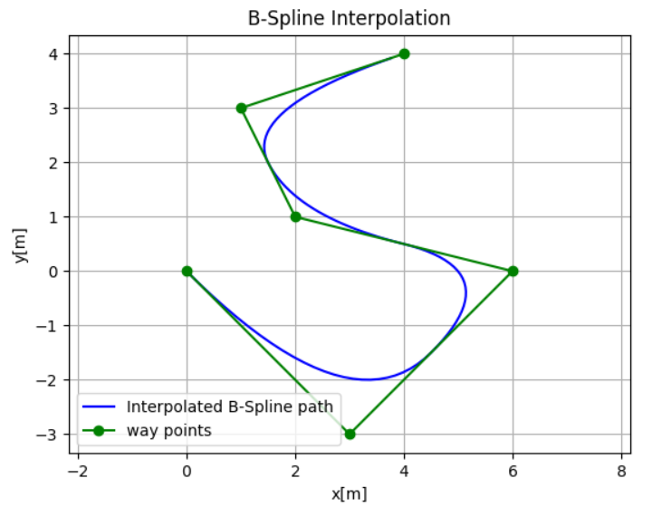</a></td>
  </tr>
</table>
</div>
<div align=center>
<table>
  <tr>
    <td>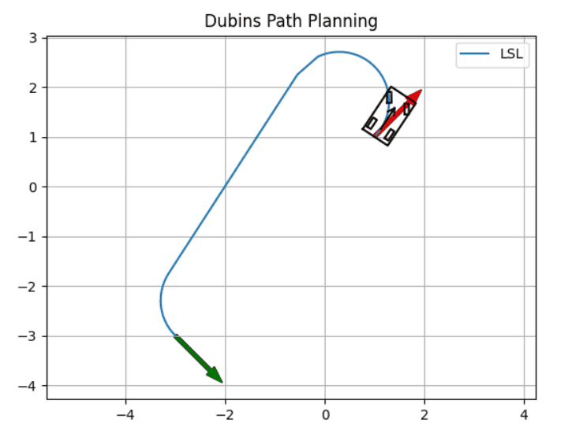</a></td>
    <td>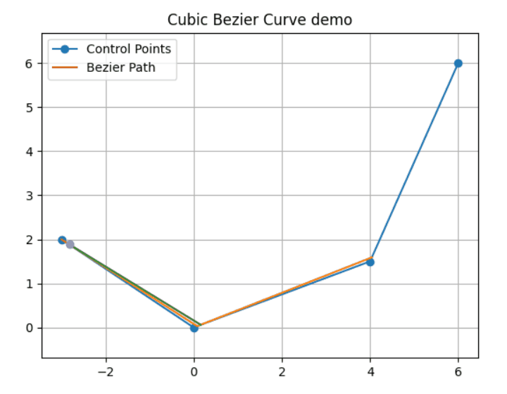</a></td>
  </tr>
</table>
</div>
<div align=center>
<table>
  <tr>
    <td>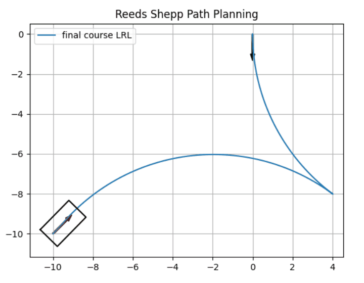</a></td>
    <td>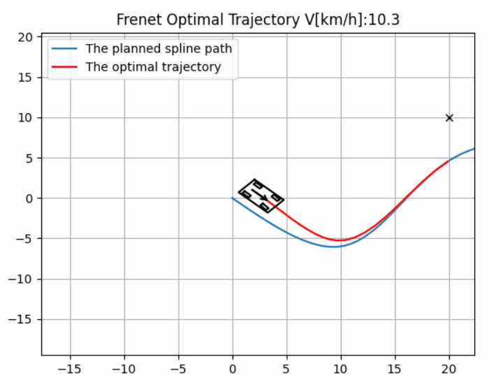</a></td>
  </tr>
</table>
</div>

### PathTracking

<div align=center>
<table>
  <tr>
    <td>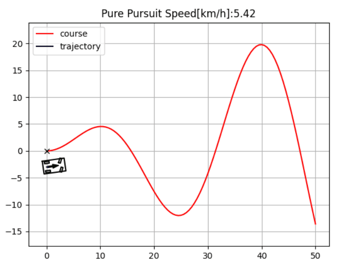</a></td>
    <td>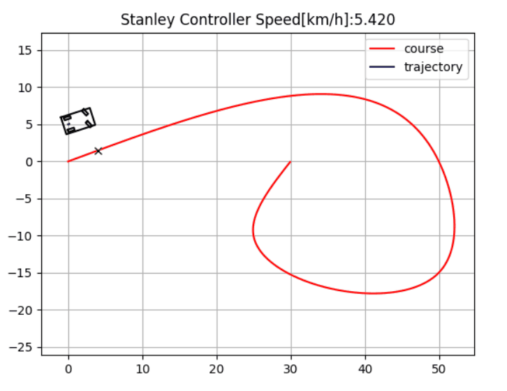</a></td>
  </tr>
</table>
</div>

<div align=center>
<table>
  <tr>
    <td>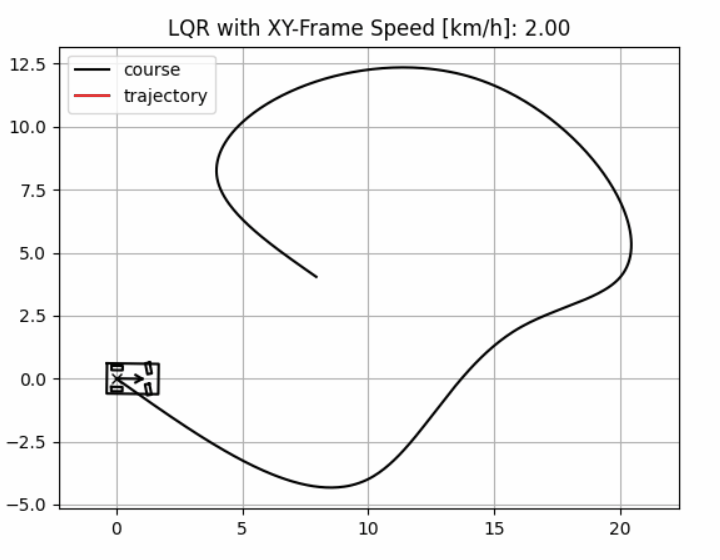</a></td>
    <td>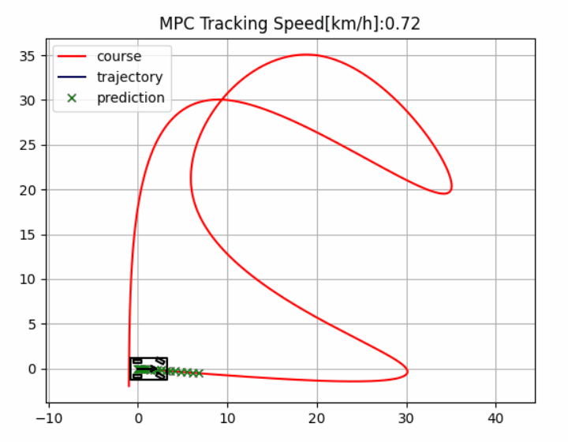</a></td>
  </tr>
</table>
</div>

### Control

<div align=center>
<table>
  <tr>
    <td>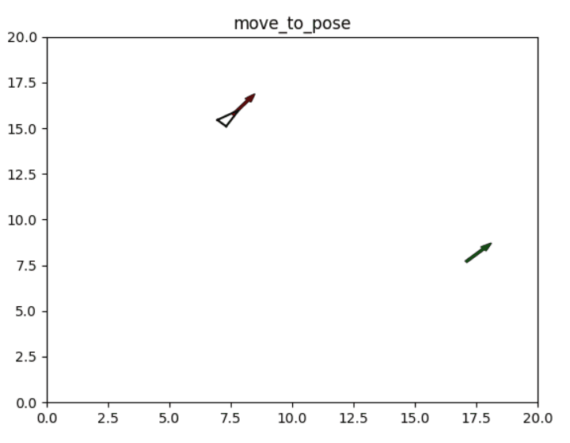</a></td>
    <td>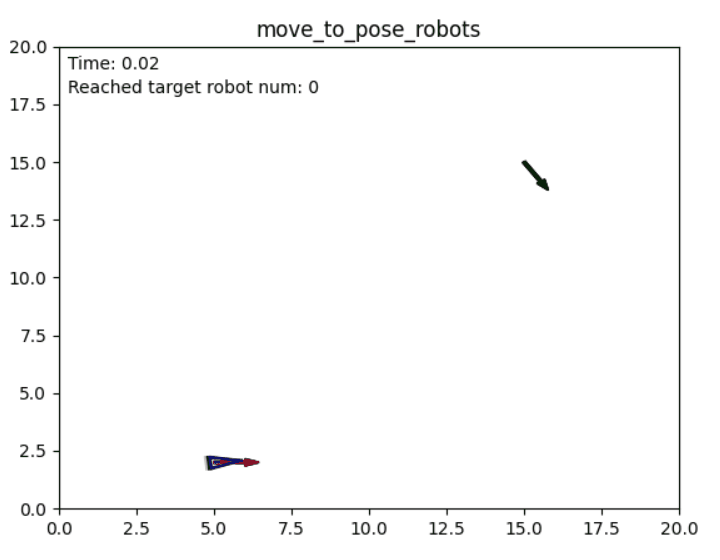</a></td>
  </tr>
</table>
</div>

## 🧾Licence

MIT
